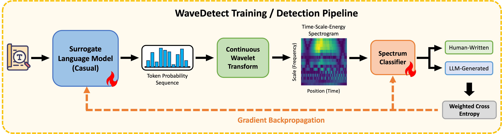

# WaveDetect: Robust Framework for Machine-Generated Text Detection via Wavelet Transform

---

🤗 **Hugging Face Model:** https://huggingface.co/KaitongQin/WaveDetect

## 📖 Overview

As Large Language Models (LLMs) asymptotically approach human-level fluency, relying on surface-level semantic artifacts for machine-generated text (MGT) detection has become increasingly precarious. Existing detectors frequently struggle with three critical challenges: adversarial perturbations, cross-domain shifts, and the rapid temporal evolution of foundation models.

**WaveDetect** is a novel framework that reformulates text detection as a signal processing task within the time-frequency domain. By applying a differentiable Continuous Wavelet Transform (CWT) to the probability sequences generated by a surrogate model, WaveDetect extracts intrinsic *spectral fingerprints* that remain invisible in the time domain.

Our method achieves state-of-the-art performance across three rigorously curated datasets ([RAID](https://github.com/liamdugan/raid), [EvoBench](https://github.com/happy-Moer/EvoBench), and [DivScore](https://github.com/richardChenzhihui/DivScore)), demonstrating exceptional robustness against sophisticated attacks, generalization to unseen topics, and resilience to evolving LLMs.

---

## ⚙️ Pipeline

The WaveDetect pipeline consists of three main components:

1. **Surrogate Language Model**  
   Converts discrete text tokens into a continuous probability signal.

2. **Continuous Wavelet Transform (CWT)**  
   Decomposes the signal into a **Time–Scale–Energy** spectrogram.

3. **Spectrum Classifier**  
   A lightweight CNN extracts discriminative spectral fingerprints to classify the text as **Human-Written** or **LLM-Generated**.


---

## 🚀 Getting Started

Follow the steps below to reproduce the results reported in the paper.

---

### 1. Data Processing

WaveDetect is evaluated comprehensively on the [RAID](https://github.com/liamdugan/raid), [EvoBench](https://github.com/happy-Moer/EvoBench), and [DivScore](https://github.com/richardChenzhihui/DivScore) (Domain-Shift) benchmarks.

First, download the raw datasets from their respective repositories. Then, use our preprocessing scripts to format them into the required `.jsonl` structure. The code for data preprocessing is located in the `data/preprocess` directory

### 2. Training
We utilize a two-stage training protocol (**Warm-up** and **Joint Training**) using a Weighted Cross-Entropy loss to maximize the decision margin and handle class imbalances.

To train WaveDetect from scratch, simply run:
```bash
bash train.sh
```

### 3. Inference
Once the model is trained, you can run inference to generate detection scores.

Navigate to the `infer/raid` directory and execute the CLI script on your processed `.jsonl` file:
```bash
cd infer/raid

python detect_cli_jsonl.py \
    -m your_test_baseline_name \
    -d your_Evobench/RAID_test_data_path \
    -o your_inferred_jsonl_path \
    -ckpt your_WaveDetect_model_name(specially_for_WaveDetect_model) \

python detect_cli_jsonl.py \
    -m your_test_baseline_name \
    -g True_if_test_DivScore \
    -o your_inferred_jsonl_path \
    -ckpt your_WaveDetect_model_name(specially_for_WaveDetect_model) \
```

### 4. Evaluation
Once the inferred `jsonl` files are ready, to compute the final performance metrics reported in the paper (such as AUROC and TPR@0.1%FPR), use the evaluation scripts:
```bash
cd evaluate

python result_divscore.py # for DivScore
python result_evobench.py # for EvoBench
python result_raid.py # for RAID
```
This script outputs a detailed performance breakdown, including robustness against adversarial attacks, temporal evolution and OOD generalization.
